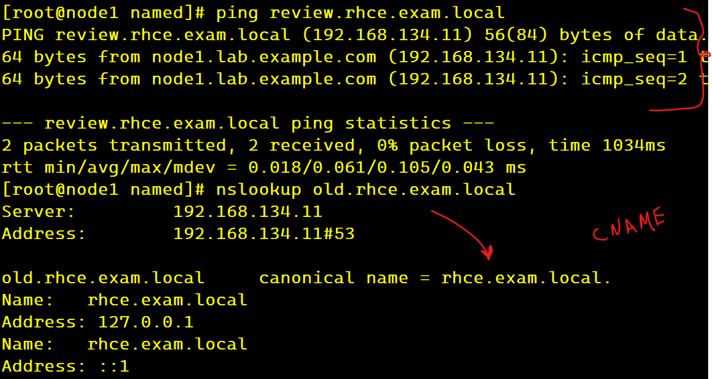
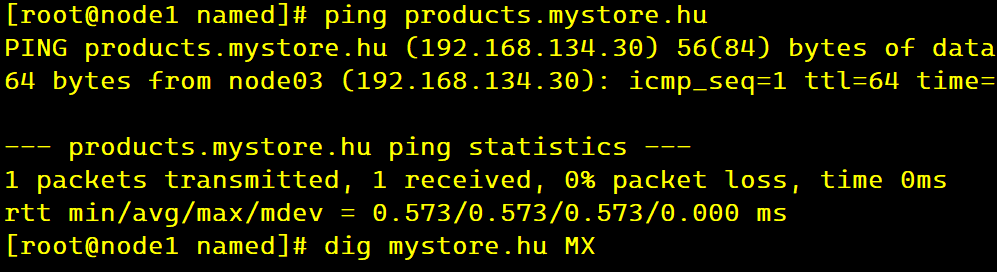
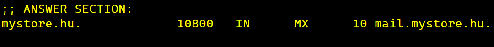
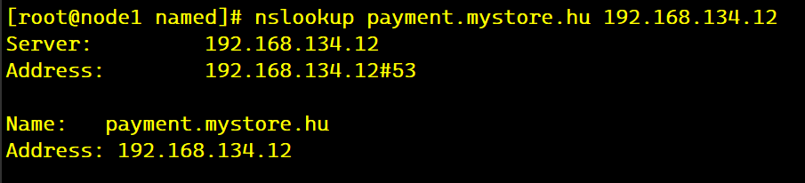
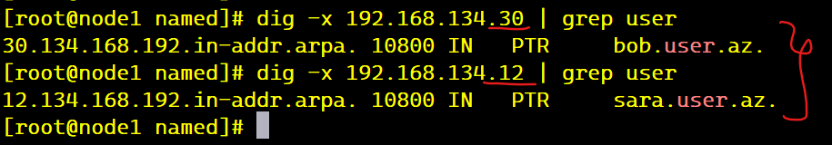
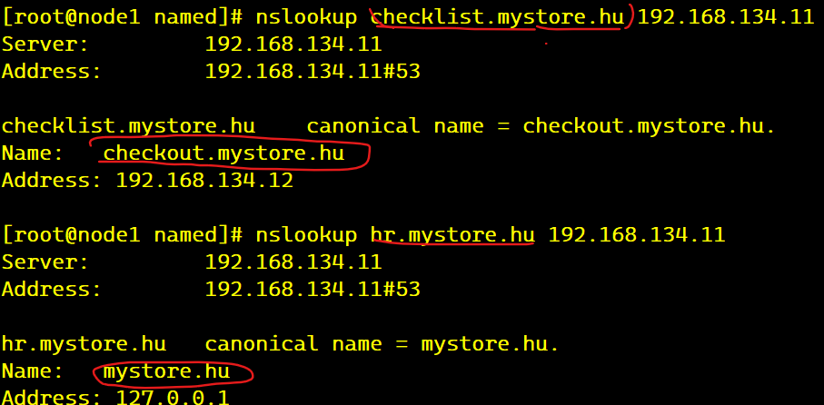
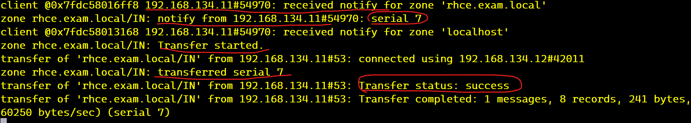

#### 1. Installing bind and bind utils.
- Firstly we need to install bind, to configure our dns 
```
yum install bind bind-utils -y
``` 
#### 2. Adding two different zones
- Now we configure `/etc/named.conf` file where we add two zones , you can find zones and full configuration in `named.conf`.
Results of resolved hostnames:  
- Zone files
    - Zone-1 `fwd.mystore.hu.zone` 
    - Zone-2 `fwd.rhce.exam.local.zone`

Zone-1

Zone-2




#### 3.Configure slave dns 
slave configuration is in `slave-dns-named.conf`.


#### 4. Configuring reverse zone (ip to hostname)
- we need to add configuration in `reverse-zone.conf` to `/etc/named.conf` file, then we have to create zone file with a name which specified as `user.az.zone`
- we can see PTR records as below 


#### 5. Mapping one domain to another one.
- we use CNAME record for domain aliases.(look records in `fwd.mystore.hu.zone`). Let's see how changes applied.


#### 6. To force slave immediately update when master zone changed. 
To do this we have to add  below syntax to `/etc/named.conf ` in options section check `named.conf` file.

```
    notify yes;
    also-notify { 192.168.134.12; };
```

This tells to slave DNS to refresh changes from master immediately when it is changed. Process takes effect when you restart "named" service in master server. You can follow logs from `/var/named/data/named.run` file.
Run `tail -f /var/named/data/named.run` and then make changes in master dns. 

Note that change refresh number to small minutes.
These logs are from named.run file

