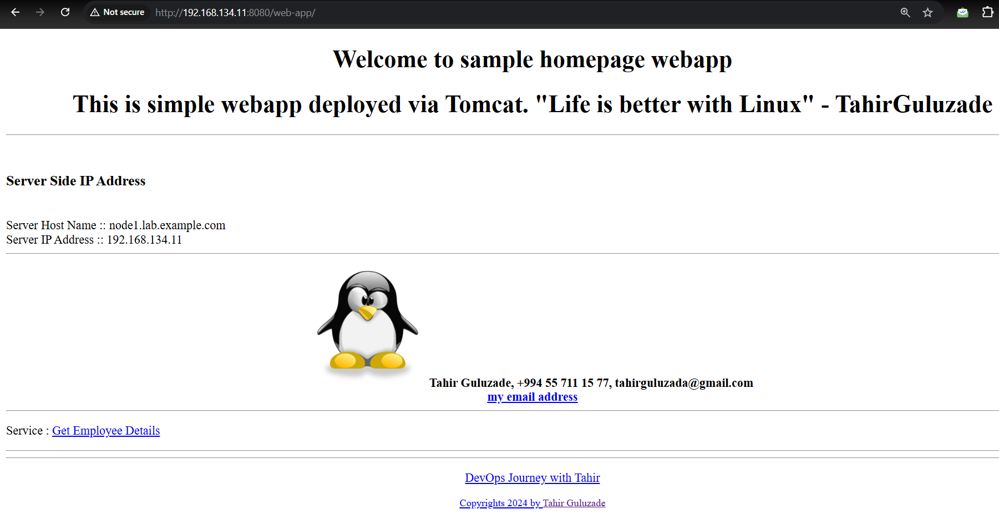
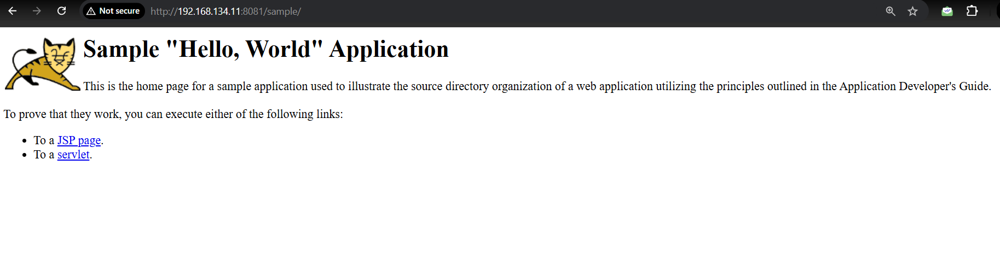

## Running web application in two Tomcat multi-instances
##### 1. Multi-instances are services which are running like isolated from each other.If one of them fails, it does not affect to other instances.
- In order to run applications as multi-instances we need to create separate directories.

```
mkdir /home/tomcat9/tomcat/instances
cp /home/tomcat9/tomcat/apache-tomcat-9.0.98  /tomcat/instances/instance1
cp /home/tomcat9/tomcat/apache-tomcat-9.0.98  /tomcat/instances/instance2
```
So, now we have `instances/instance1` and `instances/instance2` directories where we will deploy two different web apps.Each directory has own default `bin` , `work` , `conf` , `lib`.
- we need to change port configurations for every instance in `conf/server.xml` file.
    - Don't forget to add ports to firewalld 

To start and stop even to see status of instances we need to create `unit` file for each instance.

-  `/etc/systemd/system/tomcat-instance1.service`
- `/etc/systemd/system/tomcat-instance1.service`

```
systemctl enable --now tomcat-instance1.service
systemctl enable --now tomcat-instance1.service
```
Now, let's check our web applications on browser:
## Instance1 web app


## Instance2 web app
