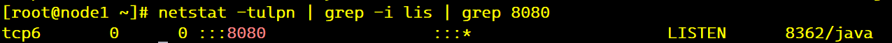

## Run web app in tomcat single-instance 
#### 1.Download java and tomcat files 
1.Firstly we create new tomcat user to do all jobs for running application, and creating tomcat and java directories for webapp. 

NOTE: our webapp is written in Java version 8, so we need to download jdk 8 and Tomcat version 9, because Tomcat 9 supports jdk 8 and later versions.
```
useradd tomcat9
mkdir /home/tomcat9/tomcat /home/tomcat9/java
```

- Now we need to download java 8
```
cd /home/java/
wget https://builds.openlogic.com/downloadJDK/openlogic-openjdk/8u432-b06/openlogic-openjdk-8u432-b06-linux-x64.tar.gz
tar -xvf openlogic-openjdk-8u432-b06-linux-x64.tar.gz
```
- Setting JAVA_HOME variable
```
vim ~/.bash_profile

JAVA_HOME=/home/tomcat9/java/openlogic-openjdk-8u432-b06-linux-x64
PATH=$PATH:$HOME/.local/bin:$HOME/bin:$JAVA_HOME/bin
export PATH JAVA_HOME

source ~/.bash_profile
``` 
- Downloading Tomcat9
```
cd /home/tomcat9/tomcat

wget https://dlcdn.apache.org/tomcat/tomcat-9/v9.0.98/bin/apache-tomcat-9.0.98.tar.gz

tar -xvf  apache-tomcat-9.0.98.tar.gz
```
- As a next step we cp `.war` file to `/home/tomcat9/tomcat/apache-tomcat-9.0.98/webapps/` to run application.
 - Let's start tomcat service 
 ```
 [tomcat9@node1 apache-tomcat-9.0.98]$ ./bin/catalina.sh start
```
As you can see below tomcat is started and running on port 8080 (default port)

```
firewall-cmd --add-port=8080/tcp --permanent
firewall-cmd --reload
```

Now open browser and type `<ip>:8080/web-app`, We got our webapp:


## 

